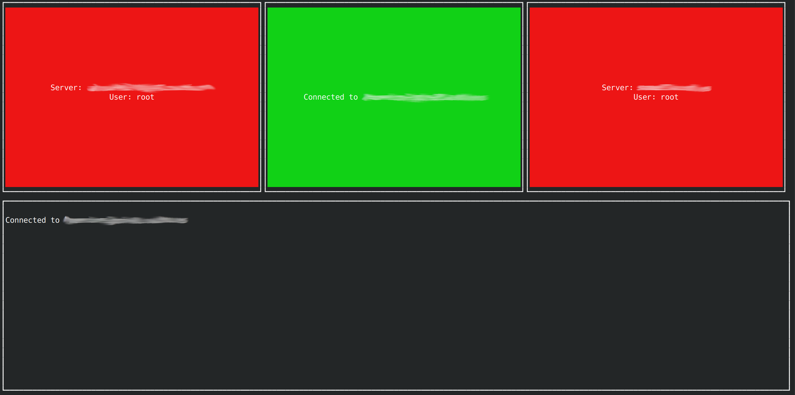

# SSHuttle Launcher

## Table of Contents
1. [Description](#description)
2. [Requirements](#requirements)
3. [Installing Requirements](#installing-requirements)
   - [Node.js and npm](#nodejs-and-npm)
   - [sshuttle](#sshuttle)
   - [blessed](#blessed)
4. [Installation of SSHuttle Launcher](#installation-of-sshuttle-launcher)
5. [Usage](#usage)
6. [Project Organization](#project-organization)
7. [Screenshots](#screenshots)
8. [License](#license)

## Description

This project provides a terminal-based graphical user interface for managing sshuttle connections. [SSHuttle](https://github.com/sshuttle/sshuttle) is a transparent proxy server that works as a VPN over SSH. With this project, you can manage multiple sshuttle connections easily.

## Requirements

Before you start, make sure you have these requirements installed:

- Node.js (version 14 or later)
- npm (Node Package Manager, comes with Node.js installation)
- sshuttle
- blessed (A Node.js module for creating terminal-based interfaces)
- SSH Access to the target servers

## Installing Requirements

### Node.js and npm

#### Ubuntu based distributions

1. Update your package list:

```bash
sudo apt update
```

2. Install Node.js and npm:

```bash
sudo apt install nodejs npm
```

#### Red Hat based distributions

For Red Hat based distributions like CentOS, you can use `dnf` (the next-generation version of `yum`):

1. Install Node.js and npm:

```bash
sudo dnf module install nodejs:14
```

### sshuttle

#### Ubuntu based distributions

Install sshuttle using the following command:

```bash
sudo apt install sshuttle
```

#### Red Hat based distributions

1. Install pip (Python's package manager):

```bash
sudo dnf install python3-pip
```

2. Install sshuttle:

```bash
pip3 install --user sshuttle
```

### blessed

Blessed is a Node.js module that can be installed via npm:

```bash
npm install blessed
```

## Installation of SSHuttle Launcher

After installing the requirements, clone the repository and install the dependencies:

```bash
cd sshuttle-launcher
npm install blessed
```

## Usage

Before you run the application, make sure to update the `config.json` file with the details of the SSH servers you want to connect to.

To run the application, use:

```bash
node app.js
```

The application presents a graphical interface with buttons representing different SSH server connections. Each button includes the server and username details and is color-coded for easy identification of connection status.

To connect to an SSH server, simply use your mouse to click on the corresponding button. The button will turn green, and a message will appear below, confirming the connection.

If you're already connected to an SSH server, clicking the same button again will disconnect the sshuttle process. The button will turn red, and a "Disconnected from sshserver" message will appear in the box below.

## Project Organization

The project has the following structure:

```
- app.js                 # The main application file
- assets                 # Directory that contains images, etc.
- config.json            # Configuration file where you define your SSH servers
- package.json           # Node.js package file
- package-lock.json      # Describes the exact tree generated in node_modules/
- README.md              # This file
```

## Screenshots

Here's a screenshot of the sshuttle terminal GUI in action:



Please note, the interface and results may vary depending on your individual configuration and the number of SSH servers you are managing.
